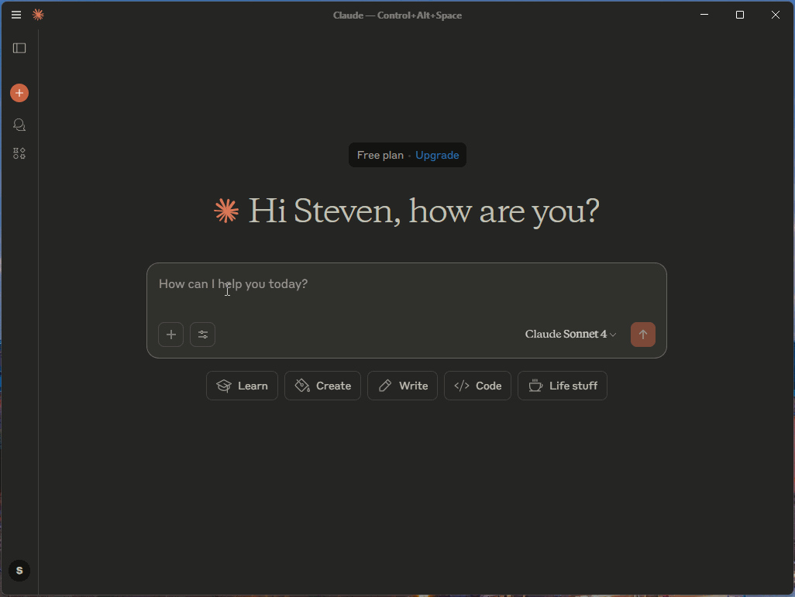

# Aviation Weather App

This project is a TypeScript-based application that retrieves and formats METAR (aviation weather) reports for airports. It provides a tool to fetch and display weather data in a human-readable format.



## Features

- Fetch METAR reports for one or more airports.
- Format METAR data into a readable string.
- Handles API errors gracefully with detailed error messages.

## Prerequisites

- [Node.js](https://nodejs.org/) (v18 or later)
- [npm](https://www.npmjs.com/) (comes with Node.js)
- Docker (optional, for containerized deployment)

## Installation

1. Clone the repository:

   ```bash
   git clone <repository-url>
   cd <repository-folder>
   ```

2. Install dependencies:

   ```bash
   npm install
   ```

3. Build the project:
   ```bash
   npm run build
   ```

## Usage

### Run Locally

To start the application locally:

```bash
npm start
```

### Run with Docker

1. Build the Docker image:

   ```bash
   docker build -t faa-aviation-weather-mcp .
   ```

2. Run the Docker container:
   ```bash
   docker run -p 3000:3000 faa-aviation-weather-mcp
   ```

## Project Structure

- `index.ts`: Main entry point of the application.
- `MetarReport.ts`: Interface for METAR report data.
- `CloudLayer.ts`: Interface for cloud layer data.
- `dist/`: Compiled JavaScript files (generated after building the project).

## Example

To fetch METAR reports for specific airports, first build the Docker image and update your MCP configuration.

For example, in Claude Desktop talkign to a container running WSL2, the `claude_desktop_config.json` would look like:

```json
{
  "mcpServers": {
    "faa-weather": {
      "command": "wsl.exe",
      "args": [
        "docker",
        "run",
        "--interactive",
        "--rm",
        "faa-aviation-weather-mcp"
      ]
    }
  }
}
```

## License

This project is licensed under the MIT License. See the [LICENSE](./LICENSE) file for details.

## Contributing

Contributions are welcome! Please open an issue or submit a pull request for any improvements or bug fixes.
